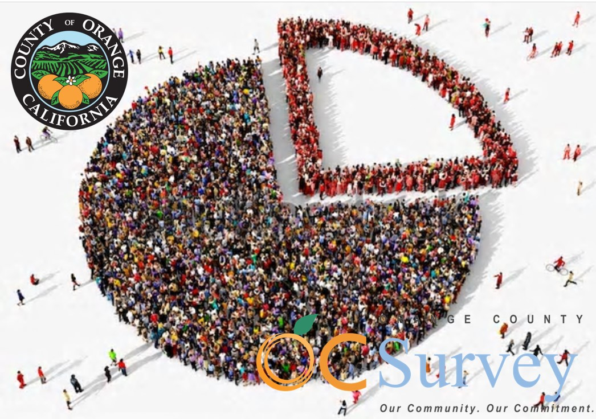

# OCACS Geodemographics Documentation   Demographic Characteristics

Orange County American Community Survey (ACS) Geodemographic Repository   Dr. Kostas Alexandridis, GISP. OC Public Works, OC Survey/Geospatial Services, 2019 - 2022.

[
<< Back to ReadMe.md
](../README.md)

 

## Geodemographic Tables by group

For each of the 14 geographies described in the previous section four categories of geodemographic characteristics are linked:

1. **Demographic characteristics (6 groups, 105 fields)**, _(this document)_
2. [Social characteristics (19 groups, 500 fields)](ACSSocial.md)
3. [Economic characteristics (19 groups, 397 fields)](ACSEconomic.md)
4. [Housing characteristics (23 groups, 406 fields)](ACSHousing.md)

Each of the geographies is represented by a separate geodatabase structure. Within of each of the geographic level geodatabases, each of the four characteristics is represented by a _feature class_ respectively. In order to easily identify each of the sub-groups within each category, the name of the original census table field was adjusted by prepending to it the subgroup identification code. For example, the original field B01001e1 would become D01_B01001e1 in the new feature class for the demographic characteristics.

A more detailed description of each sub-group within each of the four feature classes representing the ACS table characteristics is provided below. The table's columns represent: the subgroup's code; its descriptive name;the universe (summative) level of the reference; the ACS cenus table in which the original fields are located; the fields/variables of the data, and; how many fields are included in the subgroup.
 

### D: Demographic Characteristics (6 groups, 105 fields)

The demographic characteristics selected for spatial representation can be found in ACS data tables X1-X5. They are devided in 6 subgroups: sex and age, median age distribution, single race determination, race in combination with other races, Hispanic or Latino determination, and the citizen voting age population estimates.

Code|Name|Universe|Table|Fields|Count
---|---|---|---|---|---:
[D01](#d01-sex-and-age-49-variables) |Sex and age|total population|X1|B01001|49
[D02](#d02median-age-by-sex-and-race-12-variables) |Median age by sex and race|total population|X1|B01002|12
[D03](#d03-race-8-variables) |Race|total population|X2|B02001|8
[D04](#d04-race-alone-or-in-combination-with-one-or-more-other-races-7-variables) |Race alone or in combination with one or more other races|total population|X2|B02001,B02008-13|7
[D05](#d05-hispanic-or-latino-and-race-21-variables) |Hispanic or Latino and race|total population|X3|B03002|21
[D06](#d06-citizen-voting-age-population-8-variables) |Citizen voting age population|citizen, 18 and over|X5|B05003|8

 

The following fields are included for each of the demographic groups:

#### D01: Sex And Age (49 variables)

>B01001e1 (Total population); B01001e2 (Male); B01001e3 (Male, under 5 years); B01001e4 (Male, 5 to 9 years); B01001e5 (Male, 10 to 14 years); B01001e6 (Male, 15 to 17 years); B01001e7 (Male, 18 and 19 years); B01001e8 (Male, 20 years); B01001e9 (Male, 21 years); B01001e10 (Male, 22 to 24 years); B01001e11 (Male, 25 to 29 years); B01001e12 (Male, 30 to 34 years); B01001e13 (Male, 35 to 39 years); B01001e14 (Male, 40 to 44 years); B01001e15 (Male, 45 to 49 years); B01001e16 (Male, 50 to 54 years); B01001e17 (Male, 55 to 59 years); B01001e18 (Male, 60 and 61 years); B01001e19 (Male, 62 to 64 years); B01001e20 (Male, 65 and 66 years); B01001e21 (Male, 67 to 69 years); B01001e22 (Male, 70 to 74 years); B01001e23 (Male, 75 to 79 years); B01001e24 (Male, 80 to 84 years); B01001e25 (Male, 85 years and over); B01001e26 (Female); B01001e27 (Female, under 5 years); B01001e28 (Female, 5 to 9 years); B01001e29 (Female, 10 to 14 years); B01001e30 (Female, 15 to 17 years); B01001e31 (Female, 18 and 19 years); B01001e32 (Female, 20 years); B01001e33 (Female, 21 years); B01001e34 (Female, 22 to 24 years); B01001e35 (Female, 25 to 29 years); B01001e36 (Female, 30 to 34 years); B01001e37 (Female, 35 to 39 years); B01001e38 (Female, 40 to 44 years); B01001e39 (Female, 45 to 49 years); B01001e40 (Female, 50 to 54 years); B01001e41 (Female, 55 to 59 years); B01001e42 (Female, 60 and 61 years); B01001e43 (Female, 62 to 64 years); B01001e44 (Female, 65 and 66 years); B01001e45 (Female, 67 to 69 years); B01001e46 (Female, 70 to 74 years); B01001e47 (Female, 75 to 79 years); B01001e48 (Female, 80 to 84 years); B01001e49 (Female, 85 years and over).
[
<< Back to List
](#geodemographic-tables-by-group)

#### D02:Median Age By Sex and Race (12 variables)

>B01002e1 (Median age (years)); B01002e2 (Male, median age (years)); B01002e3 (Female, median age (years)); B01002Ae1 (White alone, median age (years)); B01002Be1 (Black or African American alone, median age (years)); B01002Ce1 (American Indian and Alaska Native alone, median age (years)); B01002De1 (Asian alone, median age (years)); B01002Ee1 (Native Hawaiian and Other Pacific Islander alone, median age (years)); B01002Fe1 (Some other race alone, median age (years)); B01002Ge1 (Two or more races, median age (years)); B01002He1 (White alone, not Hispanic or Latino, median age (years)); B01002Ie1 (Hispanic or Latino, median age (years)).
[
<< Back to List
](#geodemographic-tables-by-group)

#### D03: Race (8 variables)

>B02001e1 (Total population); B02001e2 (White alone); B02001e3 (Black or African American alone); B02001e4 (American Indian and Alaska Native alone); B02001e5 (Asian alone); B02001e6 (Native Hawaiian and Other Pacific Islander alone); B02001e7 (Some other race alone); B02001e8 (Two or more races).
[
<< Back to List
](#geodemographic-tables-by-group)

#### D04: Race Alone or In Combination with One or More Other Races (7 variables)

>B02001e1 (Total population); B02008e1 (White); B02009e1 (Black or African American); B02010e1 (American Indian and Alaska Native); B02011e1 (Asian); B02012e1 (Native Hawaiian and Other Pacific Islander); B02013e1 (Some other race).
[
<< Back to List
](#geodemographic-tables-by-group)

#### D05: Hispanic or Latino and Race (21 variables)

>B03002e1 (Total population); B03002e2 (Not Hispanic or Latino); B03002e3 (Not Hispanic or Latino, White alone); B03002e4 (Not Hispanic or Latino, Black or African American alone); B03002e5 (Not Hispanic or Latino, American Indian and Alaska Native alone); B03002e6 (Not Hispanic or Latino, Asian alone); B03002e7 (Not Hispanic or Latino, Native Hawaiian and Other Pacific Islander alone); B03002e8 (Not Hispanic or Latino, Some other race alone); B03002e9 (Not Hispanic or Latino, Two or more races); B03002e10 (Not Hispanic or Latino, Two races including some other race); B03002e11 (Not Hispanic or Latino, Two races excluding some other race, and three or more races); B03002e12 (Hispanic or Latino); B03002e13 (Hispanic or Latino, White alone); B03002e14 (Hispanic or Latino, Black or African American alone); B03002e15 (Hispanic or Latino, American Indian and Alaska Native alone); B03002e16 (Hispanic or Latino, Asian alone); B03002e17 (Hispanic or Latino, Native Hawaiian and Other Pacific Islander alone); B03002e18 (Hispanic or Latino, Some other race alone); B03002e19 (Hispanic or Latino, Two or more races); B03002e20 (Hispanic or Latino, Two races including some other race); B03002e21 (Hispanic or Latino, Two races excluding some other race, and three or more races).
[
<< Back to List
](#geodemographic-tables-by-group)

#### D06: Citizen Voting Age Population (8 variables)

>B05003e8 (Male, 18 years and over); B05003e9 (Male, Native US Citizen, 18 years and over); B05003e11 (Male, Foreign-born Naturalized US Citizen, 18 years and over); B05003e12 (Male, Foreign-born, not a US Citizen, 18 years and over); B05003e19 (Female, 18 years and over); B05003e20 (Female, Native US Citizem, 18 years and over); B05003e22 (Female, Foreign-born, Naturalized US Citizen, 18 years and over); B05003e23 (Female, Foreign-born, not a US Citizen, 18 years and over).
[
<< Back to List
](#geodemographic-tables-by-group)

  

[
<< Back to ReadMe.md
](../README.md)
