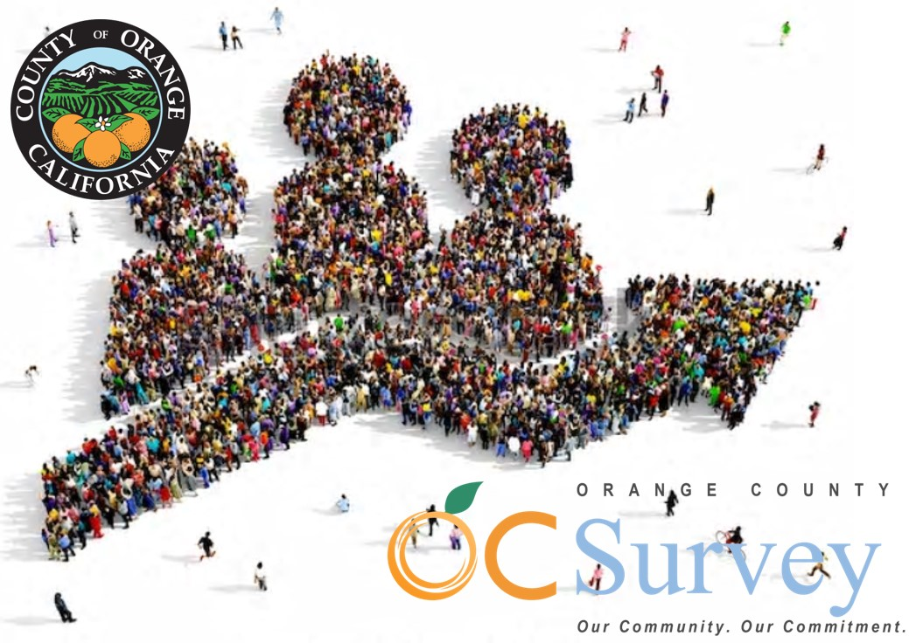

# OCACS Geodemographics Documentation   Economic Characteristics

Orange County American Community Survey (ACS) Geodemographic Repository   Dr. Kostas Alexandridis, GISP. OC Public Works, OC Survey/Geospatial Services, 2019 - 2022.

[
<< Back to ReadMe.md
](../README.md)
## Geodemographic Tables by group

For each of the 14 geographies described in the previous section four categories of geodemographic characteristics are linked:

1. [Demographic characteristics (6 groups, 105 fields)](ACSDemographic.md)
2. [Social characteristics (19 groups, 500 fields)](ACSSocial.md)
3. **Economic characteristics (19 groups, 397 fields)** _(this document)_
4. [Housing characteristics (23 groups, 406 fields)](ACSHousing.md)

Each of the geographies is represented by a separate geodatabase structure. Within of each of the geographic level geodatabases, each of the four characteristics is represented by a _feature class_ respectively. In order to easily identify each of the sub-groups within each category, the name of the original census table field was adjusted by prepending to it the subgroup identification code. For example, the original field B01001e1 would become D01_B01001e1 in the new feature class for the demographic characteristics.

A more detailed description of each sub-group within each of the four feature classes representing the ACS table characteristics is provided below. The table's columns represent: the subgroup's code; its descriptive name;the universe (summative) level of the reference; the ACS cenus table in which the original fields are located; the fields/variables of the data, and; how many fields are included in the subgroup.

  
## E: Economic Characteristics (19 groups, 397 fields)

The economic characteristics selected for spatial representation can be found in ACS data tables X8, X17, X19-20, X23-24, and X27. They are divided in 19 subgroups: employment and work status, commuting and travel time to work, vehicles available for workers, means of transportation (age and race), occupation, industry, worker's class, household income and earnings, individual and family income and earnings, health insurance coverage, ratio of income to poverty level, poverty in population, households and families, and poverty income deficit in families estimates.

Code|Name|Universe|Table|Fields|Count
---|---|---|---|---|---:
[E01](#e01-employment-status-7-variables) |Employment status|population 16 years and over|X23|B23025|7
[E02](#e02-work-status-by-age-of-worker-36-variables) |Work status by age of worker|population 16 years and over|X23|B23027|36
[E03](#e03-commuting-to-work-8-variables) |Commuting to work|workers 16 years and over|X8|B08301, B08135|8
[E04](#e04-travel-time-to-work-14-variables) |Travel time to work|workers 16 years and over who did not work at home|X8|B08012-13|14
[E05](#e05-number-of-vehicles-available-for-workers-8-variables) |Number of vehicles available for workers|workers 16 years and over in households|X8|B08014-15|8
[E06](#e06-median-age-by-means-of-transportation-to-work-7-variables) |Median age by means of transportation to work|median age, workers 16 years and over)|X8|B01103|7
[E07](#e07-means-of-transportation-to-work-by-race-64-variables) |Means of transportation to work by race|workers 16 years and over|X8|B08105|64
[E08](#e08-occupation-53-variables) |Occupation|civilian employed population 16 years and over|X24|C24010|53
[E09](#e09-industry-43-variables) |Industry|civilian employed population 16 years and over|X24|C24030|43
[E10](#e10-class-of-worker-19-variables) |Class of worker|civilian employed population 16 years and over|X24|B24080|19
[E11](#e11-household-income-and-earnings-in-the-past-12-months-37-variables) |Household income and earnings in the past 12 months|total households|X19|B19001, B19013, B19025, B19081, B19083, B19051-60, B22010|37
[E12](#e12-income-and-earnings-in-dollars-31-variables) |Income and earnings in dollars|inflation-adjusted dollars|X19, X20|B19061-69, B19113, B19202, B19214, B19301, B19313, B20002|31
[E13](#e13-family-income-in-dollars-17-variables) |Family income in dollars|total families|X19|B19101|17
[E14](#e14-health-insurance-coverage-17-variables) |Health insurance coverage|civilian non-instutionalized population|X27|B27010|17
[E15](#e15-ratio-of-income-to-poverty-level-8-variables) |Ratio of income to poverty level|total population for whom poverty level is determined|X17|C17002|8
[E16](#e16-poverty-in-population-in-the-past-12-months-7-variables) |Poverty in population in the past 12 months|total population for whom poverty is determined|X17|B17021|7
[E17](#e17-poverty-in-households-in-the-past-12-months-9-variables) |Poverty in households in the past 12 months|total households|X17|B17017|9
[E18](#e18-percentage-of-families-and-people-whose-income-in-the-past-12-months-is-below-the-poverty-level-8-variables) |Percentage of families and people whose income in the past 12 months is below the poverty level|families, population|X17|B17010|8
[E19](#e19-poverty-and-income-deficit-dollars-in-the-past-12-months-for-families-4-variables) |Poverty and income deficit (dollars) in the past 12 months for families|families with income below poverty level in the past 12 months|X17|B17011|4

 

The following fields are included for each of the economic groups:

#### E01: Employment Status (7 variables)

> B23025e1 (Population 16 years and over); B23025e2 (In labor force); B23025e3 (Civilian labor force); B23025e4 (Civilian labor force, employed); B23025e5 (Civilian labor force, unemployed); B23025e6 (Armed forces); B23025e7 (Not in labor force).
[
<< Back to List
](#e-economic-characteristics-19-groups-397-fields)

#### E02: Work Status by Age of Worker (36 variables)

> B23027e1 (Total population, 16 years and over); B23027e2 (16 to 19 years); B23027e3 (16 to 19 years, worked in the past 12 months); B23027e4 (16 to 19 years, worked full-time, year-round for the past 12 months); B23027e5 (16 to 19 years, worked less than full time, year-round for the past 12 months); B23027e6 (16 to 19 years, did not work for the past 12 months); B23027e7 (20 to 24 years); B23027e8 (20 to 24 years, worked in the past 12 months); B23027e9 (20 to 24 years, worked full-time, year-round for the past 12 months); B23027e10 (20 to 24 years, worked less than full time, year-round for the past 12 months); B23027e11 (20 to 24 years, did not work for the past 12 months); B23027e12 (25 to 44 years); B23027e13 (25 to 44 years, worked in the past 12 months); B23027e14 (25 to 44 years, worked full-time, year-round for the past 12 months); B23027e16 (25 tp 44 years, worked less than full time, year-round for the past 12 months); B23027e16 (25 to 44 years, did not work for the past 12 months); B23027e17 (45 to 54 years); B23027e18 (45 to 54 years, worked in the past 12 months); B23027e19 (45 to 54 years, worked full-time, year-round for the past 12 months); B23027e20 (45 to 54 years, worked less than full time, year-round for the past 12 months); B23027e21 (45 to 54 years, did not work for the past 12 months); B23027e22 (55 to 64 years); B23027e23 (55 to 64 years, worked in the past 12 months); B23027e24 (55 to 64 years, worked full-time, year-round for the past 12 months); B23027e25 (55 to 64 years, worked less than full time, year-round for the past 12 months); B23027e26 (55 to 64 years, did not work for the past 12 months); B23027e27 (65 to 69 years); B23027e28 (65 to 69 years, worked in the past 12 months); B23027e29 (65 to 69 years, worked full-time, year-round for the past 12 months); B23027e30 (65 to 69 years, worked less than full time, year-round for the past 12 months); B23027e31 (65 to 69 years, did not work for the past 12 months); B23027e32 (70 years and over); B23027e33 (70 years and over, worked in the past 12 months); B23027e34 (70 years and over, worked full-time, year-round for the past 12 months); B23027e35 (70 years and over, worked less than full time, year-round for the past 12 months); B23027e36 (70 years and over, did not work for the past 12 months).
[
<< Back to List
](#e-economic-characteristics-19-groups-397-fields)
#### E03: Commuting to Work (8 variables)

> B08301e1 (Workers 16 years and over); B08301e3 (Car, truck, or van - drove alone); B08301e4 (Car, truck, or van - carpooled); B08301e10 (Public transportation (excluding taxicab)); B08301e19 (Walked); B08301e20 (Other means); B08301e21 (Worked at home); B08135e1 (Aggregate travel time to work (minutes)).
[
<< Back to List
](#e-economic-characteristics-19-groups-397-fields)

#### E04: Travel Time to Work (14 variables)

> B08012e1 (Total workers 16 years and over who did not work at home); B08012e2 (Less than 5 minutes); B08012e3 (5 to 9 minutes); B08012e4 (10 to 14 minutes); B08012e5 (15 to 19 minutes); B08012e6 (20 to 24 minutes); B08012e7 (25 to 29 minutes); B08012e8 (30 to 34 minutes); B08012e9 (35 to 39 minutes); B08012e10 (40 to 44 minutes); B08012e11 (45 to 59 minutes); B08012e12 (60 to 89 minutes); B08012e13 (90 or more minutes); B08013e1 (Aggregate time to work (in minutes)).
[
<< Back to List
](#e-economic-characteristics-19-groups-397-fields)

#### E05: Number of Vehicles Available for Workers (8 variables)

> B08014e1 (Workers 16 years and over in households); B08014e2 (No vehicle available); B08014e3 (1 vehicle available); B08014e4 (2 vehicles available); B08014e5 (3 vehicles available); B08014e6 (4 vehicles available); B08014e7 (5 or more vehicles available); B08015e1 (Aggregate number of vehicles (car, truck or van) used in commuting).
[
<< Back to List
](#e-economic-characteristics-19-groups-397-fields)

#### E06: Median Age by Means of Transportation to Work (7 variables)

> B08103e1 (Median age, total workers 16 years and over); B08103e2 (Median age, using car, truck or van - drove alone); B08103e3 (Median age, using car, truck or van - carpooled); B08103e4 (Median age, using public transportation); B08103e5 (Median age, walked); B08103e6 (Median age, using taxicab, motorcycle, bicycle, or other means); B08103e7 (Median age, worked at home).
[
<< Back to List
](#e-economic-characteristics-19-groups-397-fields)

#### E07: Means of Transportation to Work by Race (64 variables)

> B08301e1 (Workers, 16 years and over); B08105Ae1 (White alone); B08105Ae2 (White alone, car, truck, or van - drove alone); B08105Ae3 (White alone, car, truck, or van - carpooled); B08105Ae4 (White alone, public transportation); B08105Ae5 (White alone, walked); B08105Ae6 (White alone, taxicab, motorcycle, bicycle, or other means); B08105Ae7 (White alone, worked at home); B08105Be1 (Black or African American alone); B08105Be2 (Black or African American alone, car, truck, or van - drove alone); B08105Be3 (Black or African American alone, car, truck, or van - carpooled); B08105Be4 (Black or African American alone, public transportation); B08105Be5 (Black or African American alone, walked); B08105Be6 (Black or African American alone, taxicab, motorcycle, bicycle, or other means); B08105Be7 (Black or African American alone, worked at home); B08105Ce1 (American Indian and Alaska Native alone); B08105Ce2 (American Indian and Alaska Native alone, car, truck, or van - drove alone); B08105Ce3 (American Indian and Alaska Native alone, car, truck, or van - carpooled); B08105Ce4 (American Indian and Alaska Native alone, public transportation); B08105Ce5 (American Indian and Alaska Native alone, walked); B08105Ce6 (American Indian and Alaska Native alone, taxicab, motorcycle, bicycle, or other means); B08105Ce7 (American Indian and Alaska Native alone, worked at home); B08105De1 (Asian alone); B08105De2 (Asian alone, car, truck, or van - drove alone); B08105De3 (Asian alone, car, truck, or van - carpooled); B08105De4 (Asian alone, public transportation); B08105De5 (Asian alone, walked); B08105De6 (Asian alone, taxicab, motorcycle, bicycle, or other means); B08105De7 (Asian alone, worked at home); B08105Ee1 (Native Hawaiian and Other Pacific Islander alone); B08105Ee2 (Native Hawaiian and Other Pacific Islander alone, car, truck, or van - drove alone); B08105Ee3 (Native Hawaiian and Other Pacific Islander alone, car, truck, or van - carpooled); B08105Ee4 (Native Hawaiian and Other Pacific Islander alone, public transportation); B08105Ee5 (Native Hawaiian and Other Pacific Islander alone, walked); B08105Ee6 (Native Hawaiian and Other Pacific Islander alone, taxicab, motorcycle, bicycle, or other means); B08105Ee7 (Native Hawaiian and Other Pacific Islander alone, worked at home); B08105Fe1 (Some other race alone); B08105Fe2 (Some other race alone, car, truck, or van - drove alone); B08105Fe3 (Some other race alone, car, truck, or van - carpooled); B08105Fe4 (Some other race alone, public transportation); B08105Fe5 (Some other race alone, walked); B08105Fe6 (Some other race alone, taxicab, motorcycle, bicycle, or other means); B08105Fe7 (Some other race alone, worked at home); B08105Ge1 (Two or more races); B08105Ge2 (Two or more races, car, truck, or van - drove alone); B08105Ge3 (Two or more races, car, truck, or van - carpooled); B08105Ge4 (Two or more races, public transportation); B08105Ge5 (Two or more races, walked); B08105Ge6 (Two or more races, taxicab, motorcycle, bicycle, or other means); B08105Ge7 (Two or more races, worked at home); B08105He1 (White alone, not Hispanic or Latino); B08105He2 (White alone, not Hispanic or Latino, car, truck, or van - drove alone); B08105He3 (White alone, not Hispanic or Latino, car, truck, or van - carpooled); B08105He4 (White alone, not Hispanic or Latino, public transportation); B08105He5 (White alone, not Hispanic or Latino, walked); B08105He6 (White alone, not Hispanic or Latino, taxicab, motorcycle, bicycle, or other means); B08105He7 (White alone, not Hispanic or Latino, worked at home); B08105Ie1 (Hispanic or Latino); B08105Ie2 (Hispanic or Latino, car, truck, or van - drove alone); B08105Ie3 (Hispanic or Latino, car, truck, or van - carpooled); B08105Ie4 (Hispanic or Latino, public transportation); B08105Ie5 (Hispanic or Latino, walked); B08105Ie6 (Hispanic or Latino, taxicab, motorcycle, bicycle, or other means); B08105Ie7 (Hispanic or Latino, worked at home).
[
<< Back to List
](#e-economic-characteristics-19-groups-397-fields)

#### E08: Occupation (53 variables)

> C24010e1 (Civilian employed population 16 years and over); C24010e2 (Male); C24010e5 (Male, management occupations); C24010e6 (Male, business and financial operations occupations); C24010e8 (Male, computer and mathematical occupations); C24010e9 (Male, architecture and engineering occupations); C24010e10 (Male, life, physical, and social science occupations); C24010e12 (Male, community and social service occupations); C24010e13 (Male, legal occupations); C24010e14 (Male, education, training, and library occupations); C24010e15 (Male, arts, design, entertainment, sports, and media occupations); C24010e17 (Male, health diagnosing and treating practitioners and other technical occupations); C24010e18 (Male, health technologists and technicians occupations); C24010e20 (Male, healthcare support occupations); C24010e22 (Male, fire fighting and prevention, and other protective service occupations); C24010e23 (Male, law enforcement occupations); C24010e24 (Male, food preparation and serving related occupations); C24010e25 (Male, building and grounds cleaning and meintanence occupations); C24010e26 (Male, personal care and service occupations); C24010e28 (Male, sales and related occupations); C24010e29 (Male, office and administrative support occupations); C24010e31 (Male, farming, fishing, and forestry occupations); C24010e32 (Male, construction and extraction occupations); C24010e33 (Male, installation, maintenance and repair occupations); C24010e35 (Male, production occupations); C24010e36 (Male, transportation occupations); C24010e37 (Male, material moving occupations); C24010e38 (Female); C24010e41 (Female, management occupations); C24010e42 (Female, business and financial operations occupations); C24010e44 (Female, computer and mathematical occupations); C24010e45 (Female, architecture and engineering occupations); C24010e46 (Female, life, physical, and social science occupations); C24010e48 (Female, community and social service occupations); C24010e49 (Female, legal occupations); C24010e50 (Female, education, training, and library occupations); C24010e51 (Female, arts, design, entertainment, sports, and media occupations); C24010e53 (Female, health diagnosing and treating practitioners and other technical occupations); C24010e54 (Female, health technologists and technicians occupations); C24010e56 (Female, healthcare support occupations); C24010e58 (Female, fire fighting and prevention, and other protective service occupations); C24010e59 (Female, law enforcement occupations); C24010e60 (Female, food preparation and serving related occupations); C24010e61 (Female, building and grounds cleaning and meintanence occupations); C24010e62 (Female, personal care and service occupations); C24010e64 (Female, sales and related occupations); C24010e65 (Female, office and administrative support occupations); C24010e67 (Female, farming, fishing, and forestry occupations); C24010e68 (Female, construction and extraction occupations); C24010e69 (Female, installation, maintenance and repair occupations); C24010e71 (Female, production occupations); C24010e72 (Female, transportation occupations); C24010e73 (Female, material moving occupations).
[
<< Back to List
](#e-economic-characteristics-19-groups-397-fields)

#### E09: Industry (43 variables)

> C24030e1 (Civilian employed population 16 years and over); C24030e2 (Male); C24030e4 (Male, agriculture, forestry, fishing and hunting); C24030e5 (Male, mining, quarrying, and oil and gas extraction); C24030e6 (Male, construction); C24030e7 (Male, manufacturing); C24030e8 (Male, wholesale trade); C24030e9 (Male, retail trade); C24030e11 (Male, transportation and warehousing); C24030e12 (Male, utilities); C24030e13 (Male, information); C24030e15 (Male, finance and insurance); C24030e16 (Male, real estate and rental and leasing); C24030e18 (Male, professional, scientific and technical services); C24030e19 (Male, management of companies and enterprises); C24030e20 (Male, administrative and support and waste management services); C24030e22 (Male, educational services); C24030e23 (Male, health care and social assistance); C24030e25 (Male, arts, entertainment, and recreation); C24030e26 (Male, accommodation and food services); C24030e27 (Male, other services, except public administration); C24030e28 (Male, public administration); C24030e29 (Female); C24030e31 (Female, agriculture, forestry, fishing and hunting); C24030e32 (Female, mining, quarrying, and oil and gas extraction); C24030e33 (Female, construction); C24030e34 (Female, manufacturing); C24030e35 (Female, wholesale trade); C24030e36 (Female, retail trade); C24030e38 (Female, transportation and warehousing); C24030e39 (Female, utilities); C24030e40 (Female, information); C24030e42 (Female, finance and insurance); C24030e43 (Female, real estate and rental and leasing); C24030e45 (Female, professional, scientific and technical services); C24030e46 (Female, management of companies and enterprises); C24030e47 (Female, administrative and support and waste management services); C24030e49 (Female, educational services); C24030e50 (Female, health care and social assistance); C24030e52 (Female, arts, entertainment, and recreation); C24030e53 (Female, accommodation and food services); C24030e54 (Female, other services, except public administration); C24030e55 (Female, public administration).
[
<< Back to List
](#e-economic-characteristics-19-groups-397-fields)

#### E10: Class of Worker (19 variables)

> B24080e1 (Civilian employed population 16 years and over); B24080e2 (Male); B24080e4 (Male, employee of private company workers); B24080e5 (Male, self-employed in own incorporated business workers); B24080e6 (Male, private not-for-profit wage and salary workers); B24080e7 (Male, local government workers); B24080e8 (Male, state government workers); B24080e9 (Male, federal government workers); B24080e10 (Male, self-employed in own not incorporated business workers); B24080e11 (Male, unpaid family workers); B24080e12 (Female); B24080e14 (Female, employee of private company workers); B24080e15 (Female, self-employed in own incorporated business workers); B24080e16 (Female, private not-for-profit wage and salary workers); B24080e17 (Female, local government workers); B24080e18 (Female, state government workers); B24080e19 (Female, federal government workers); B24080e20 (Female, self-employed in own not incorporated business workers); B24080e21 (Female, unpaid family workers).
[
<< Back to List
](#e-economic-characteristics-19-groups-397-fields)

#### E11: Household Income and Earnings in the Past 12 Months (37 variables)

> B19001e1 (Total households); B19001e2 (Households, less than $10,000); B19001e3 (Households, $10,000 to $14,999); B19001e4 (Households, $15,000 to $19,999); B19001e5 (Households, $20,000 to $24,999); B19001e6 (Households, $25,000 to $29,999); B19001e7 (Households, $30,000 to $34,999); B19001e8 (Households, $35,000 to $39,999); B19001e9 (Households, $40,000 to $44,999); B19001e10 (Households, $45,000 to $49,999); B19001e11 (Households, $50,000 to $59,999); B19001e12 (Households, $60,000 to $74,999); B19001e13 (Households, $75,000 to $99,999); B19001e14 (Households, $100,000 to $124,999); B19001e15 (Households, $125,000 to $149,999); B19001e16 (Households, $150,000 to $199,999); B19001e17 (Households, $200,000 or more); B19013e1 (Median household income (dollars)); B19025e1 (Aggregate household income (dollars)); B19081e1 (Mean household income of lowest quintile); B19081e2 (Mean household income of second quntile); B19081e3 (Mean household income of third quintile); B19081e4 (Mean household income of fourth quintile); B19081e5 (Mean household income of highest quintile); B19081e6 (Mean household income of top 5 percent); B19083e1 (Gini index of income inequality); B19051e2 (Househols with earnings); B19051e3 (Households without earnings); B19052e2 (Households with wage or salary income); B19053e2 (Households with self-employment income); B19054e2 (Households with interest, dividents, or net rental income); B19055e2 (Households with social security income); B19056e2 (Households with supplemental security income); B19057e2 (Households with public assistance income); B19059e2 (Households with retirement income); B19060e2 (Households with other types of income); B22010e2 (Households received food stamps/SNAP income).
[
<< Back to List
](#e-economic-characteristics-19-groups-397-fields)

#### E12: Income and Earnings in Dollars (31 variables)

> B19061e1 (Aggregate earnings in households); B19062e1 (Aggregate wage or salary income in households); B19063e1 (Aggregate self-employment income in households); B19064e1 (Aggregate interest, dividents, or net rental income in households); B19065e1 (Aggregate social security income in households); B19066e1 (Aggregate supplemental security income in households); B19067e1 (Aggregate public assistance income in households); B19069e1 (Aggregate retirement income in households); B19069e1 (Aggregate other types of income in household); B19113e1 (Median family income); B19202e1 (Median nonfamily household income); B19214e1 (Aggregate nonfamily household income); B19301e1 (Per capita income (total population)); B19301Ae1 (Per capita income, White alone); B19301Be1 (Per capita income, Black or African American alone); B19301Ce1 (Per capita income, American Indian and Alaska Native alone); B19301De1 (Per capita income, Asian alone); B19301Ee1 (Per capita income, Native Hawaiian and Other Pacific Islander alone); B19301Fe1 (Per capita income, some other race alone); B19301Ge1 (Per capita income, two or more races); B19301He1 (Per capita income, White alone, not Hispanic or Latino); B19301Ie1 (Per capita income, Hispanic or Latino); B19313e1 (Aggregate income (total population)); B20002e1 (Median earnings (total population)); B20002e2 (Median earnings, male population); B20002e3 (Median earnings, female population); B20003e1 (Aggregate earnings (total population)); B20003e2 (Aggregate earnings, male population); B20003e3 (Aggregate earnings, male, worked full-time); B20003e5 (Aggregate earnings, female population); B20003e6 (Aggregate earnings, female, worked full-time).
[
<< Back to List
](#e-economic-characteristics-19-groups-397-fields)

#### E13: Family income in dollars (17 variables)

> B19101e1 (Total families); B19101e2 (Families, less than $10,000); B19101e3 (Families, $10,000 to $14,999); B19101e4 (Families, $15,000 to $19,999); B19101e5 (Families, $20,000 to $24,999); B19101e6 (Families, $25,000 to $29,999); B19101e7 (Families, $30,000 to $34,999); B19101e8 (Families, $35,000 to $39,999); B19101e9 (Families, $40,000 to $44,999); B19101e10 (Families, $45,000 to $49,999); B19101e11 (Families, $50,000 to $59,999); B19101e12 (Families, $60,000 to $74,999); B19101e13 (Families, $75,000 to $99,999); B19101e14 (Families, $100,000 to $124,999); B19101e15 (Families, $125,000 to $149,999); B19101e16 (Families, $150,000 to $199,999); B19101e17 (Families, $200,000 or more).
[
<< Back to List
](#e-economic-characteristics-19-groups-397-fields)

#### E14: Health Insurance Coverage (17 variables)

> B27010e1 (Civilian non-institutionalized population); B27010e2 (Under 19 years); B27010e3 (Under 19 years, with one type of health insurance coverage); B27010e10 (Under 19 years, with two or more types of health insurance coverage); B27010e17 (Under 19 years, without health insurance coverage); B27010e18 (19 to 34 years); B27010e19 (19 to 34 years, with one type of health insurance coverage); B27010e26 (19 to 34 years, with two or more types of health insurance coverage); B27010e33 (19 to 34 years, without health insurance coverage); B27010e34 (35 to 64 years); B27010e35 (35 to 64 years, with one type of health insurance coverage); B27010e42 (35 to 64 years, with two or more types of health insurance coverage); B27010e50 (35 to 64 years, without health insurance coverage); B27010e51 (65 years and over); B27010e52 (65 years and over, with one type of health insurance coverage); B27010e58 (65 years and over, with two or more types of health insurance coverage); B27010e66 (65 years and over, without health insurance coverage).
[
<< Back to List
](#e-economic-characteristics-19-groups-397-fields)

#### E15: Ratio of Income to Poverty Level (8 variables)

> C17002e1 (Total population (for whom poverty status id determined)); C17002e2 (Under 0.50); C17002e3 (0.50 to 0.99); C17002e4 (1.00 to 1.24); C17002e5 (1.25 to 1.49); C17002e6 (1.50 to 1.84); C17002e7 (1.84 to 1.99); C17002e8 (2.00 and over).
[
<< Back to List
](#e-economic-characteristics-19-groups-397-fields)

#### E16: Poverty in Population in the Past 12 Months (7 variables)

> B17021e1 (Total population (for whom poverty status is determined)); B17021e2 (Population below poverty level); B17021e3 (Population in family households below poverty level); B17021e4 (Population in married couple family households below poverty level); B17021e8 (Population in male householder, no wife present households below poverty level); B17021e11 (Population in female householder, no husband present households below poverty level); B17021e14 (Population in nonfamily households below poverty level).
[
<< Back to List
](#e-economic-characteristics-19-groups-397-fields)

#### E17: Poverty in Households in the Past 12 Months (9 variables)

> B17017e1 (Total households); B17017e2 (All households below poverty level); B17017e3 (Family households below poverty level); B17017e4 (Married couple family households below poverty level); B17017e10 (Male householder, no wife present households below poverty level); B17017e15 (Female householder, no husband present households below poverty level); B17017e20 (Nonfamily households below poverty level); B17017e21 (Nonfamily households, male householder below poverty level); B17017e26 (Nonfamily households, female householder below poverty level).
[
<< Back to List
](#e-economic-characteristics-19-groups-397-fields)

#### E18: Percentage of Families and People Whose Income in the Past 12 Months is Below the Poverty Level (8 variables)

> B17010e1 (All families); B17010e2 (All families below poverty level); B17010e3 (Married couple families below poverty level); B17010e4 (Married couple families with related children under 18 years below poverty level); B17010e10 (Male householder, no wife present families below poverty level); B17010e11 (Male householder, no wife present families with related children under 18 years below poverty level); B17010e16 (Female householder, no husband present families below poverty level); B17010e17 (Female householder, no husband present families with related children under 18 years below poverty level).
[
<< Back to List
](#e-economic-characteristics-19-groups-397-fields)

#### E19: Poverty and Income Deficit (dollars) in the Past 12 Months for Families (4 variables)

> B17011e1 (Families below poverty: aggregate income deficit (past 12 months)); B17011e2 (Married couple families below poverty: aggregate income deficit); B17011e4 (Male householder, no wife present below poverty: aggregrate income deficit); B17011e5 (Female householder, no husband present below poverty: aggregate income deficit).
[
<< Back to List
](#e-economic-characteristics-19-groups-397-fields)

  

[
<< Back to ReadMe.md
](../README.md)
