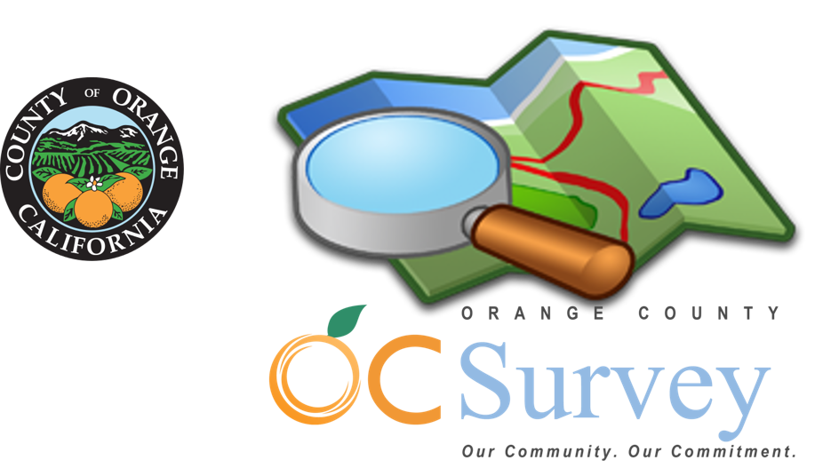

# OC Survey American Community Survey (ACS) Geodemographics Repository
*Dr. Kostas Alexandridis, GISP   OC Public Works, OC Survey Geospatial Services, 2019-2022.*

## Description

This repository contains basic code for processing, customizing and displaying geodatabases containing the spatially-explicit data of the US Census American Community Survey (ACS), 5-year estimates for the Orange County, California.

## Census Data

The original data are downloaded from the US Census TIGER/Line dataset with linked ACS demographic tables.
*Data source:* [US Census TIGER/Line with Selected Demographic and Economic Data](https://www.census.gov/geographies/mapping-files/time-series/geo/tiger-data.html).

## Geographies included

The dataset incude 14 separate geographies, and 25 data tables per geography in each geodatabase. Specifically, the included geographies are:

| Category | Level | Abbrev | Description |
|:---|:---|:---:|:---|
| Administrative | County | CO | County of Orange |
|| County Subdivisions | CS | Orange County Subdivisions |
|| Cities/Places | PL | Orange County Cities |
|| ZIP Codes | ZC | ZIP Code Tabulation Areas for Orange County |
| Political | Congressional Districts | CD | Congressional Districts, 113th-116th US Congress for Orange County |
|| State Assembly | LL | State Assembly Legislative Districts (Lower) for Orange County |
|| State Senate | UL | State Senate Legislative Districts (Upper) for Orange County |
| Education | Elementary | ED | Elementary School Districts for Orange County |
|| Secondary | SD | Secondary School Districts for Orange County |
|| Unified | UD | Unified School Districts for Orange County |
| Census | Urban Areas | UA | Urban Areas for Orange and Los Angeles Counties |
|| Public Use Microdata Areas | PU | Census Public Use Microdata Areas (PUMA) for Orange County |
|| Block Groups | BG | Census Block Groups for Orange County |
|| Census Tracts | TR | Census Tracts for Orange County |

## Geodemographic Tables by group

For each of the 14 geographies described in the previous section four categories of geodemographic characteristics are linked:

1. [Demographic Characteristics (6 groups, 105 fields)](Documentation/ACSDemographic.md)
2. [Social Characteristics (19 groups, 500 fields)](Documentation/ACSSocial.md)
3. [Economic Characteristics (19 groups, 397 fields)](Documentation/ACSEconomic.md)
4. [Housing Characteristics (19 groups, 406 fields)](Documentation/ACSHousing.md)

Each of the geographies is represented by a separate geodatabase structure. Within of each of the geographic level geodatabases, each of the four characteristics is represented by a *feature class* respectively. In order to easily identify each of the sub-groups within each category, the name of the original census table field was adjusted by prepending to it the subgroup identification code. For example, the original field B01001e1 would become D01_B01001e1 in the new feature class for the demographic characteristics.

A more detailed description of each sub-group within each of the four feature classes representing the ACS table characteristics is provided in each of the sections above (opens the documentation markdown file). The table's columns represent: the subgroup's code; its descriptive name;the universe (summative) level of the reference; the ACS cenus table in which the original fields are located; the fields/variables of the data, and; how many fields are included in the subgroup.

## Geodatabase Feature Class Metadata Description

Tabulation of level abbreviations by geography and ACS category characteristics. The 3-letter abbreviation consists of:

* First and second letter: *Geography level* (14-levels)
* Third letter: *ACS category characteristics* (4-levels)

*Total abbreviations: 14 georaphies x 4 characteristics = 56 feature class levels (four in each geodatabase).*

| Geography | Demographic (D) | Social (S) | Economic (E) | Housing (H) |
| :--- | :---: | :---: | :---: | :---: |
| 1. County (CO) | COD | COS | COE | COH |
| 2. County Subdivision (CS) | CSD | CSS | CSE | CSH |
| 3. Cities/Places (PL) | PLD | PLS | PLE | PLH |
| 4. ZIP Code Tabulation Areas (ZC) | ZCD | ZCS | ZCE | ZCH |
| 5. Congressional Districts (CD) | CDD | CDS | CDE | CDH |
| 6. State Assembly Legislative Districts (LL) | LLD | LLS | LLE | LLH |
| 7. State Senate Legislative Districts (UL) | ULD | ULS | ULE | ULH |
| 8. Elementary School Districts (ED) | EDD | EDS | EDE | EDH |
| 9. Secondary School Districts (SD) | SDD | SDS | SDE | SDH |
| 10. Unified School Districts (UD) | UDD | UDS | UDE | UDH |
| 11. Urban Areas (UA) | UAD | UAS | UAE | UAH |
| 12. Public Use Microdata Areas (PU) | PUD | PUS | PUE | PUH |
| 13. Block Groups (BG) | BGD | BGS | BGE | BGH |
| 14. Census Tracts (TR) | TRD | TRS | TRE | TRH |

For complete geodatabase metadata information and description, please <a href="Documentation/GeodatabaseMetadata.md" target="_blank">follow this link to the full metadata document.</a>
